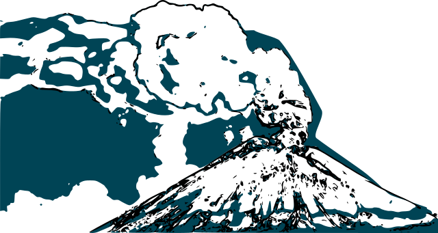
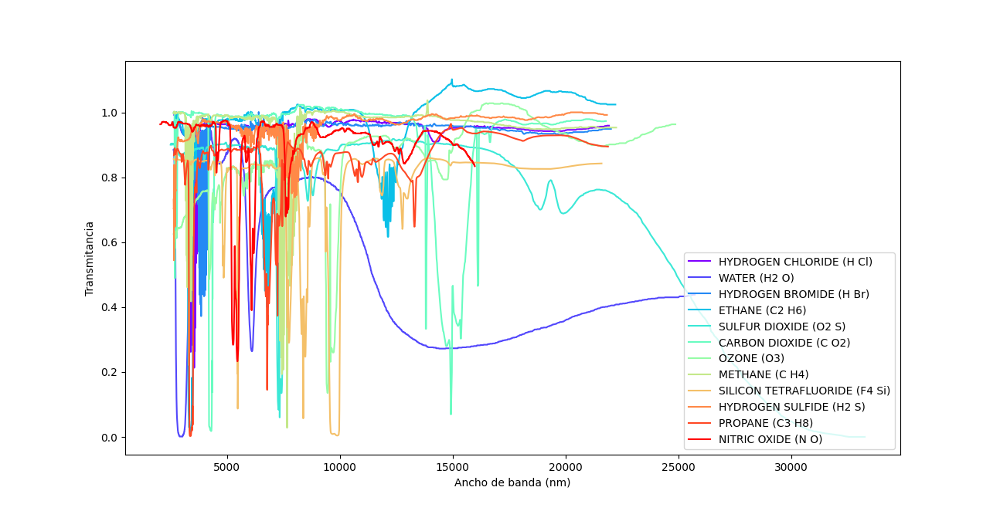

<br />
<p align="center">
  <a href="https://github.com/aubravo/ActividadVolcanica">
    
  </a>

  <h3 align="center">Clasificación de actividad volcánica del Popocatépetl aplicando algoritmos de aprendizaje automático</h3>

  <p align="center">
    Proyecto de tesis para la Maestría en Ciencia de Datos e Inteligencia de Negocios en UPAEP
    <br />
    <a href="https://github.com/aubravo/ActividadVolcanica/issues">Report Bug</a>
    ·
    <a href="https://github.com/aubravo/ActividadVolcanica/issues">Request Feature</a>
  </p>
</p>


<!-- TABLE OF CONTENTS -->
<details open="open">
  <summary><h2 style="display: inline-block">Contenido</h2></summary>
  <ol>
    <li>
      <a href="#sobre-el-proyecto">Sobre el proyecto</a>
      <ul>
        <li><a href="#built-with">Built With</a></li>
      </ul>
    </li>
    <li>
      <a href="#cómo-empezar">Cómo empezar</a>
      <ul>
        <li><a href="#requisitos">Requisitos</a></li>
        <li><a href="#instalación">Instalaciónn</a></li>
      </ul>
    </li>
    <li><a href="#uso">Uso</a></li>
    <ul>
      <li><a href="#jcampreader">JcampReader</a></li>
    </ul>
    <li><a href="#contacto">Contacto</a></li>
    <li><a href="#acknowledgements">Acknowledgements</a></li>
  </ol>
</details>


## Sobre el proyecto

El presente proyecto forma parte de mi proyecto de titulación de tesis para la Maestría en Ciencia de Datos e Inteligencia de Negocios, el cual consiste en diversas etapas y tiene como objetivo final, establecer los requisitos para la carga útil del satelite Gxiba y comprobar la capacidad de clasificación de actividad volcánica utilizando imágenes hiperespectrales satelitales.


### Built With

* Python3:
  * [pyplot](https://matplotlib.org/stable/tutorials/introductory/pyplot.html)
  * []()


<!-- GETTING STARTED -->
## Cómo empezar

To get a local copy up and running follow these simple steps.

### Requisitos

This is an example of how to list things you need to use the software and how to install them.


### Instalación

1. Clone the repo
   ```sh
   git clone https://github.com/aubravo/ActividadVolcanica
   ```

## Uso


### JCampReader
<p align="center">
  <a href="https://github.com/aubravo/ActividadVolcanica">
    
  </a>
</p>

La primera sección de este proyecto, utiliza documentos JCamp obtenidos de la base de datos de la base de datos [Chemestry Webhook](https://webbook.nist.gov/chemistry/) del National Institute of Standards and Technology. Al analizar estos archivos, es posible obtener la respuesta de cada uno de los compuestos moleculares de interés en el espectro infrarrojo.

De esta manera, es posible identificar claramente la interacción existente entre los compuestos moleculares presentes en exhalaciones volcánicas y seleccionar las bandas del espectro electromagnético de mayor interés para la calibración de una cámara hiperespectral satelital.

Los archivos JCamp se almacenan en la carpeta [JCampReader/IR](https://github.com/aubravo/ActividadVolcanica/tree/master/JcampReader/IR) de este proyecto y el script GasGraph.py permite graficar los resultados de la interpretación de dichos archivos.


<!-- CONTACT -->
## Contacto

Alvaro U. Bravo - [alvaroulises.bravo@upaep.edu.mx](mailto:alvaroulises.bravo@upaep.edu.mx) / [alvaroubravo@gmail.com](mailto:alvaroubravo@gmail.com)

Enlace del proyecto: [https://github.com/aubravo/ActividadVolcanica](https://github.com/aubravo/ActividadVolcanica)


<!-- ACKNOWLEDGEMENTS -->
## Acknowledgements

* []()
* []()
* []()
